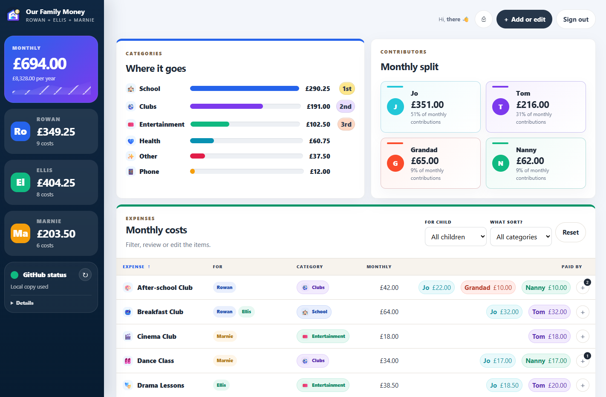

<p align="center">
  
</p>

<h1 align="center">Our Family Money</h1>

<p align="center">
  A small, GitHub-backed family expense tracker for expected monthly child costs.
</p>

<p align="center">
  <a href="https://lively-moss-0115bc403.7.azurestaticapps.net"><strong>View the demo</strong></a>
</p>



Our Family Money tracks expected monthly family costs, shows who pays what, and keeps an optional log of actual payments underneath each expense.

There is no database. The source of truth is one JSON file, so changes are easy to review, back up, and undo.

This public repository is intended to be safe to share. The committed `data/expenses.json` file contains fake demo data only. A private live deployment can point the API at a separate private GitHub repository or private JSON path using Azure app settings.

---

## What it does

- Shows the monthly total for family expenses.
- Splits costs between the configured payers.
- Groups expenses by child and category.
- Supports one-off payment entries under each expense.
- Works across desktop, iPad, and phone layouts.
- Can be installed to an iPad/iPhone home screen as a PWA.
- Uses a friendly editor for normal changes, with a JSON editor for bulk fixes.
- Saves approved changes back to GitHub.
- Uses Azure Static Web Apps authentication for family-only access.

---

## Data file

The bundled demo/example data lives here:

```text
data/expenses.json
```

In demo mode, the app uses this fake data and keeps edits in the browser session so visitors can try the editor without changing the repository.

In live mode, the app asks the API for the configured GitHub data file. When the editor saves, it writes the updated JSON back to that configured GitHub location.

Deployment settings and the live/demo split are documented in [DEPLOYMENT.md](./DEPLOYMENT.md).

---

## Demo site behaviour

The same codebase can run as a public demo if the Azure Static Web App does not have GitHub data settings configured.

Demo view:

```text
https://lively-moss-0115bc403.7.azurestaticapps.net
```

When `GITHUB_TOKEN`, `GITHUB_OWNER`, or `GITHUB_REPO` is missing:

- `GET /api/expenses` returns bundled fake demo data.
- `PUT /api/expenses` validates the edited data and returns success without writing to GitHub.
- The browser stores demo edits in `sessionStorage`, so the dashboard and editor stay in sync during that tab/session.

This lets people try the app without needing access to the private family data source.

---

## JSON document shape

`data/expenses.json` is one JSON object with three top-level sections:

- `family` — the children and payers the app should know about.
- `categories` — the managed category list, including emoji and chart colour.
- `expenses` — the monthly costs and any logged payment entries.

Minimal example:

```json
{
  "family": {
    "children": [
      {
        "id": "child-one",
        "name": "Child One",
        "initial": "C",
        "color": "#2563eb"
      },
      {
        "id": "child-two",
        "name": "Child Two",
        "initial": "C",
        "color": "#7c3aed"
      }
    ],
    "payers": [
      {
        "id": "payer-one",
        "name": "Payer One",
        "initial": "J",
        "color": "#2563eb"
      },
      {
        "id": "payer-two",
        "name": "Payer Two",
        "initial": "D",
        "color": "#7c3aed"
      }
    ]
  },
  "categories": [
    {
      "name": "Category One",
      "emoji": "🎒",
      "color": "#2563eb"
    },
    {
      "name": "Category Two",
      "emoji": "⚜️",
      "color": "#7c3aed"
    }
  ],
  "expenses": [
    {
      "name": "Example Monthly Cost",
      "emoji": "📌",
      "children": ["child-one"],
      "category": "Category One",
      "monthlyCost": 39.19,
      "paidBy": {
        "payer-one": 39.19,
        "payer-two": 0
      },
      "entries": [
        {
          "date": "2026-07-10",
          "description": "Example one-off payment",
          "amount": 156.77
        }
      ]
    }
  ]
}
```

All three top-level sections are required.

---

## Category model

Categories are managed separately from expenses so their emoji and chart colour stay consistent.

Example:

```json
{
  "name": "Category Three",
  "emoji": "📌",
  "color": "#10b981"
}
```

If you manually add a new expense category in JSON, also add it to the managed `categories` list so the app knows its emoji and colour.

---

## Family model

Children and payers are managed at the top of `data/expenses.json`, and the app builds the dashboard cards, filters and editor buttons from these arrays.

The `family` section should look like this:

```json
{
  "children": [
    {
      "id": "child-one",
      "name": "Child One",
      "initial": "C",
      "color": "#2563eb"
    }
  ],
  "payers": [
    {
      "id": "payer-one",
      "name": "Payer One",
      "initial": "J",
      "color": "#2563eb"
    }
  ]
}
```

Use stable lowercase IDs in expenses, and edit the display names/colours in the family model.

---

## Expense model

Each expense represents an expected monthly cost.

Example:

```json
{
  "name": "Example Monthly Cost",
  "emoji": "📌",
  "children": ["child-one"],
  "category": "Category One",
  "monthlyCost": 39.19,
  "paidBy": {
    "payer-one": 39.19,
    "payer-two": 0
  },
  "entries": [
    {
      "date": "2026-07-10",
      "description": "Example one-off payment",
      "amount": 156.77
    }
  ]
}
```

Important bits:

- `children` is always an array of child IDs, even for one child.
- Use both child IDs when the expense belongs to both children.
- `category` should match one of the managed category names.
- `monthlyCost` is the expected monthly average.
- `paidBy` uses payer IDs as keys, and the values should add up to the monthly cost.
- `emoji` is the emoji for this specific expense. The category also has its own emoji.
- `entries` is optional context and does not automatically change the monthly average.

---

## Entries

Entries are for real payments or useful payment history under an existing expense.

Example:

```json
{
  "date": "2026-06-10",
  "description": "Summer camp - Balance",
  "amount": 50
}
```

Entries are useful for things like:

- camp payments;
- school term passes;
- one-off uniform or kit payments;
- ad-hoc scout/cub events.

They are not meant for broad budgeting pots or fuzzy family spending. If a bank statement contains possible child costs, verify them before adding them.

---

## Editor

The app editor has four tabs:

- Friendly editor — for everyday changes.
- Categories — for category names, emojis, and chart colours.
- Family — for children and payers, including names, IDs, initials, and colours.
- JSON editor — for direct bulk edits.

The friendly editor supports:

- selecting an expense;
- adding a new expense;
- changing name, category, children, monthly cost, payer split, and emoji;
- choosing from a full emoji picker;
- spreading a one-off payment across several months while logging the original payment as an entry;
- removing an expense;
- saving back to GitHub.

The one-off helper does not change the JSON model. It simply calculates the monthly average, updates the payer split, and adds the payment to `entries`.

The editor is split into separate pages for expenses, categories, family, and raw JSON. Each page scrolls normally instead of hiding other editor screens behind JavaScript tabs.

Deployment settings and GitHub data-source configuration are documented in `DEPLOYMENT.md`.

---

## Authentication and logout

The site uses Azure Static Web Apps authentication.

Only authorised family users should be able to access and save data.

Authentication uses separate pages:

- `/auth/login.html` for choosing GitHub or Microsoft sign-in;
- `/auth/access-denied.html` for signed-in accounts without the `family` role;
- `/auth/signed-out.html` after logout.

The dashboard stays in `index.html`, so dashboard scrolling is not mixed together with login screens.

Logout sends the user to the app’s signed-out page. Microsoft or GitHub may still keep their own browser session active, so going back in may not always require typing credentials again.

---

## PWA support

The site includes:

- a web app manifest;
- app icons;
- Apple touch icon metadata.

This lets the site be added to an iPad/iPhone home screen and opened in standalone mode without the browser address bar.

---

## Technology

- HTML
- CSS
- Vanilla JavaScript
- Azure Static Web Apps
- Azure Function API for saving
- GitHub-backed JSON data

---

## License

Licensed under the [MIT License](./LICENSE).

---

## Design goals

The project should stay:

- simple;
- fast;
- mobile friendly;
- clear rather than playful;
- database free;
- easy to review through GitHub history.

It is not trying to become a full budgeting app.

The main question it answers is:

> What are our expected monthly family expenses, and who is paying what?
