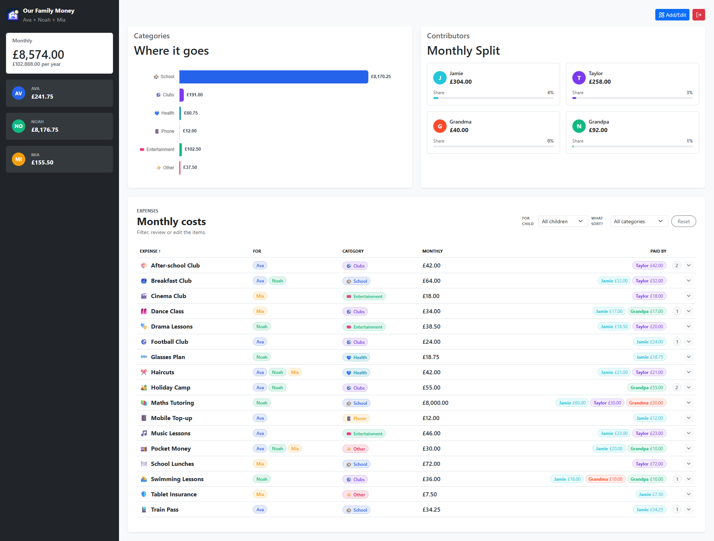
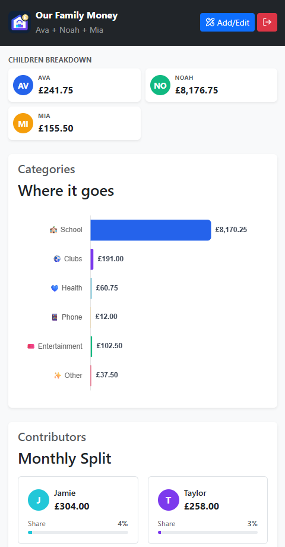

<p align="center">
  
</p>

<h1 align="center">Our Family Money</h1>

<p align="center">
  Know exactly what your family's monthly costs are, and who's paying for what — without a spreadsheet, a database, or a subscription.
</p>

<p align="center">
  <a href="https://expenses-demo.rawritscloud.com"><strong>Try the live demo →</strong></a>
</p>

<p align="center">
  
</p>

Kids' expenses add up fast — camps, activities, school costs, subscriptions — and they're rarely split evenly. Our Family Money gives you one clean dashboard for what you expect to pay each month, who's covering it, and which child it's for, plus a running log of what's actually been paid.

No database to host, no accounts to manage, no monthly bill for yet another app. Your data lives in a single JSON file version-controlled on GitHub, so every change is backed up, reviewable, and easy to undo — just like code.

---

## Why you'll like it

- **See it all at a glance** — monthly total, yearly projection, and a breakdown by child and category, with a chart that makes it obvious where the money goes.
- **Fair splits, made visible** — every expense shows exactly who pays what, and how much each contributor covers overall.
- **Log real payments, not just plans** — record and delete actual payment entries inline, right from the dashboard.
- **Find things fast** — sort and filter the expense table by child, category, name, or cost; a clean card view kicks in on mobile.
- **Edit without fear** — a friendly editor for expenses, categories, and family members, plus a raw JSON editor for power users, all with an unsaved-changes safety net.
- **Share it safely** — run a public demo that looks and feels real but never touches your actual data, while your private family data stays in a private repo.
- **Family-only, by default** — sign in with GitHub or Microsoft; only approved family members can see or change anything in live mode.
- **Feels like a real app** — install it to your phone or desktop home screen as a PWA and open it full-screen, no browser chrome.

<p align="center">
  
</p>

---

## Getting started

```bash
npm install
npm run dev
```

Live mode needs an auth backend the plain dev server doesn't have, so the fastest way to poke around is **demo mode** with bundled sample data:

```bash
# PowerShell
$env:VITE_APP_MODE="demo"; npm run dev
```

or drop a `.env.local` file in the project root:

```text
VITE_APP_MODE=demo
```

Other handy scripts:

```bash
npm run build     # production build to dist/
npm run preview   # serve the built dist/
npm run lint      # eslint
```

Want to run the full stack with real authentication and GitHub saving, or deploy your own copy? See **[DEPLOYMENT.md](./DEPLOYMENT.md)**.

---

## How your data is organized

Everything lives in one JSON file (`src/data/expenses.json` for the bundled demo data), with three sections:

- **`family`** — the children and payers the app knows about.
- **`categories`** — your category list, each with an emoji and a chart colour.
- **`expenses`** — the monthly costs themselves, plus any logged payment entries.

A minimal example:

```json
{
  "family": {
    "children": [
      { "id": "child-one", "name": "Child One", "initial": "C", "color": "#2563eb" }
    ],
    "payers": [
      { "id": "payer-one", "name": "Payer One", "initial": "J", "color": "#2563eb" },
      { "id": "payer-two", "name": "Payer Two", "initial": "D", "color": "#7c3aed" }
    ]
  },
  "categories": [
    { "name": "Category One", "emoji": "🎒", "color": "#2563eb" }
  ],
  "expenses": [
    {
      "name": "Example Monthly Cost",
      "emoji": "📌",
      "children": ["child-one"],
      "category": "Category One",
      "monthlyCost": 39.19,
      "paidBy": { "payer-one": 39.19, "payer-two": 0 },
      "entries": [
        { "date": "2026-07-10", "description": "Example one-off payment", "amount": 156.77 }
      ]
    }
  ]
}
```

Most of the time you'll never touch this JSON directly — the in-app editor handles it. A few things worth knowing:

- `paidBy` values should add up to `monthlyCost`, so splits stay accurate.
- `entries` is an optional running log of real payments and doesn't affect the monthly average.
- An optional `endDate` (`YYYY-MM-DD`) retires an expense from the dashboard automatically once it passes, while keeping it visible (shaded, under "Ended") and editable.

---

## Design goals

Our Family Money aims to stay simple, fast, mobile-friendly, database-free, and easy to review through GitHub history. It answers one question:

> What are our expected monthly family expenses, and who is paying what?

It is not trying to become a full budgeting app.

---

## License

Released under the [MIT License](./LICENSE).
